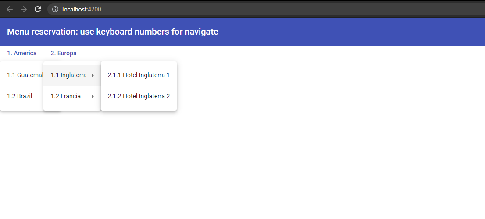

# MenusAnalisis
Pequeño proyecto para analisis tarea 2-1

## Objetivos:
- Agregar un menu, que tenga submenus
- Que este menu pueda ser accededito por mediante numeros

## Objetivos alcanzados
- Menu con submenus funcionando
- Se puede acceder al menu mediate los numero 1 y 2 del teclado

## Imagen de ejemplo
